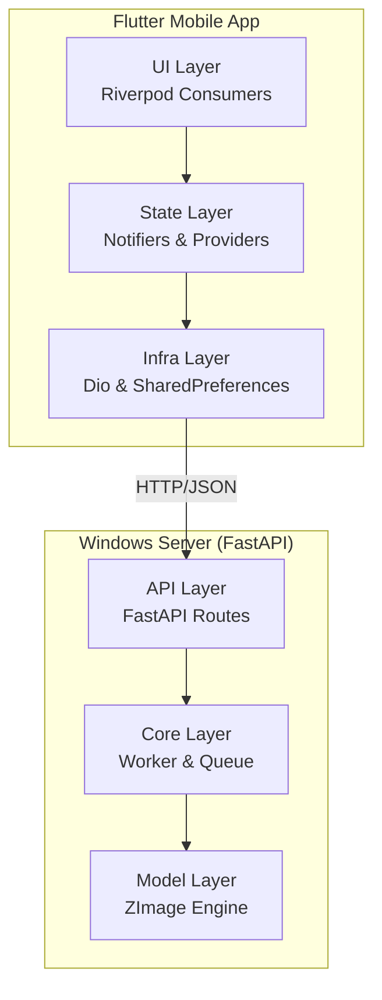
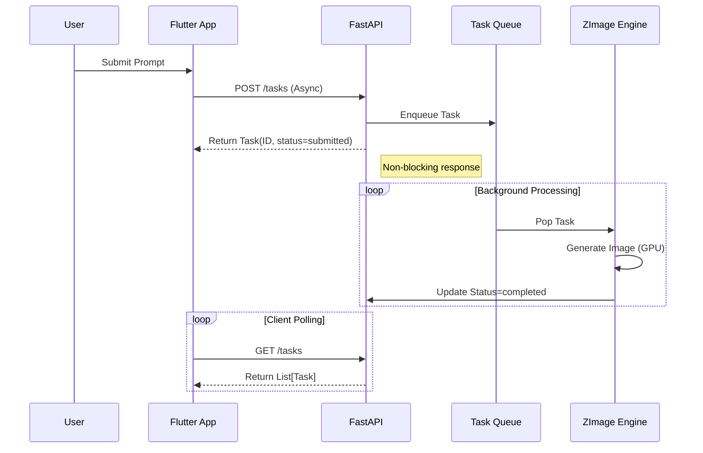
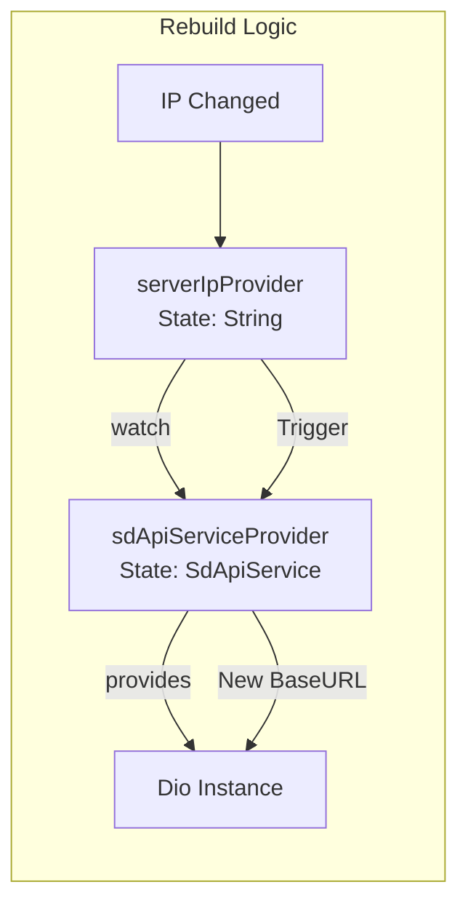
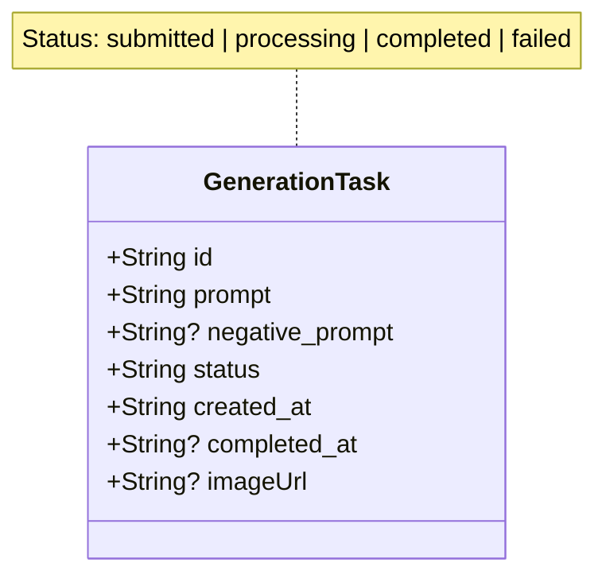

# Next Generate App - 架构与规划

## 📐 系统全景

> **Core Context**: 前端 Flutter (Riverpod + Dio) + 后端 FastAPI (Windows + ZImage) + 本地局域网通信

## 🔄 关键业务流 (Critical Flows)

### 1. 生成任务 (Generation Pipeline)

### 2. 连接管理 (Connectivity & State)

> **Design Decision**: 使用 `NotifierProvider` 分离状态读取与操作，确保 IP 变更时自动重建 API 实例。

## 📦 核心数据结构 (Data Schema)

## 🛠️ 技术栈清单 (Tech Stack)

- **Frontend**: Flutter, Riverpod (State), GoRouter, Dio, CachedNetworkImage
- **Backend**: Python, FastAPI, Uvicorn, Diffusers (ZImage/BF16), Asyncio
- **Protocol**: HTTP REST, JSON
- **Storage**: 
  - Front: SharedPreferences (Config)
  - Back: JSON File (Task Metadata), Local File System (Images)

---
*注：具体代码实现请直接参考各模块源码，本文档仅作为架构索引。*
